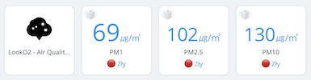
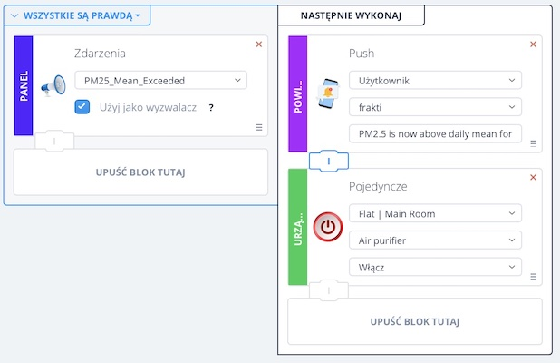

# Fibaro QuickApp - LookO2 Air Quality Sensor

 
LookO2 Air Quality sensors integration in our Fibaro HC3.

## Features

- Creates three multi-sensor child devices corresponding to particles PM2.5, PM10 and PM1 monitoring - those devices can be later used as a trigger in your Scenes
- Provides short and long air quality description with shown trend
- Periodically calls LookO2 API to fetch sensor data based on picked device ID
- Allows manually refresh sensor data
- Allows to find nearest sensor with distance calculation (assuming you've provided your location in HC Settings
- Sends Custom Event `PM25_Mean_Exceeded` when PM2.5 particle norms are exceeded for long period of time - this event can be used as a trigger in your Scenes
- Discovers offline and dirty sensors
- Languages: supports english and polish - based on configured language in HC Settings

If you don't have a LookO2 sensor nearby you can always purchase one from [LookO2 shop](https://sklep.looko2.com).

## Usage

Fill variables:

- `API_TOKEN` - You can get one by contacting kontakt@looko2.com
- `DEVICE_ID` - Pick one from [LookO2 map](https://www.looko2.com/heatmap.php) and use ID from URL `search` query param (or use `Find nearest sensor` feature)
- `EXCEEDED_HOURS` - It defines a number of hours within last day, for which PM2.5 hourly moving average value must exceed norm to trigger `PM25_Mean_Exceeded` event. Example: assume it's set to `12`, and within last day from 22:00 - 7:00 (9 hours) and 14:00 - 17:00 (3 hours) PM2.5 average exceeds `PM25_DAILY_MEAN`. The event is triggered at 17:00. Then it waits `EXCEEDED_HOURS` hours before it could again trigger the event.
- `PM25_DAILY_MEAN` - Defines PM2.5 daily norm - by default using 24-hour mean from WHO guidelines which is 25 ㎍/㎥
- `PM10_DAILY_MEAN` - Defines PM10 daily norm - by default using 24-hour mean from WHO guidelines which is 50 ㎍/㎥
- `QA_ICON_ID` - ID of icon for main device. It's not yet possible to automatically install icon within QA, so you must upload it on your own. To do that, pick one of child sensors and upload one of two device icons found on the repository. Then use DevTools to find it's ID, if you're not familiar with the tool just try IDs above 1000.

Additional notes:
- QuickApp is using `looko2` Global Variable to store persistent state, please don't delete it.
- If you don't see any values please check firstly Fibaro Console.

**If you have found a bug or have feature request please drop me a line on Fibaro Marketplace or just create GitHub issue.**

## Screenshots

- Devices list

- Example scene - uses custom event as a trigger

- Example scene - uses opened window and PM2.5 sensor value as a trigger

## Development Resources
- [LookO2 API](https://looko2web.nazwa.pl/aktualnosci/api/)
- [Fibaro API](https://manuals.fibaro.com/knowledge-base-browse/rest-api/) - can't find HC3 API but apparently API I'm using still works
- [HC2 Version](https://marketplace.fibaro.com/items/looko2-air-quality-sensor)
- [HC3 QuickApps coding - tips and tricks](https://forum.fibaro.com/topic/49113-hc3-quickapps-coding-tips-and-tricks/)
